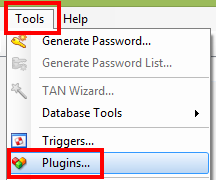
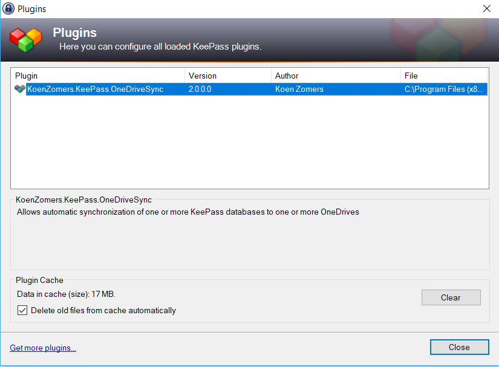
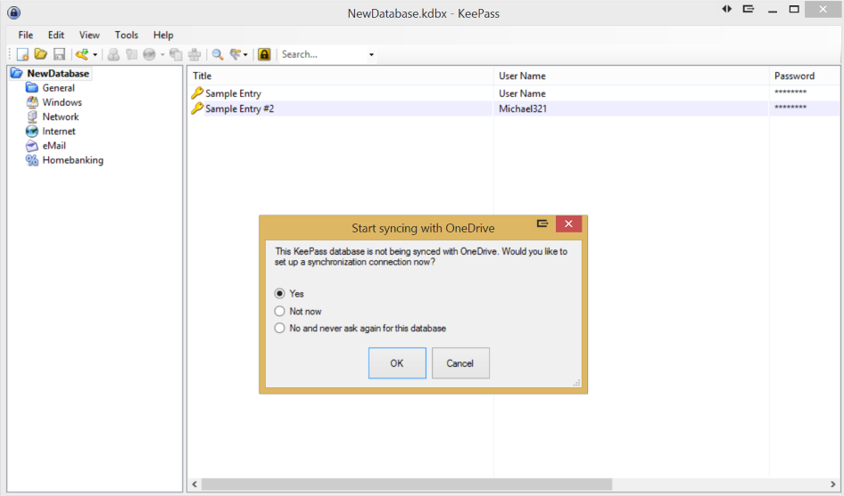
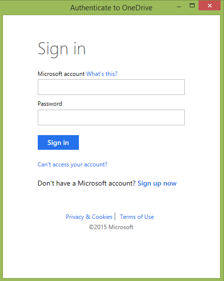
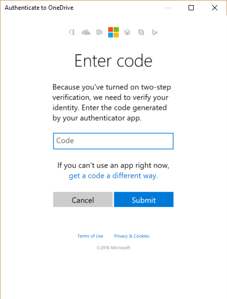
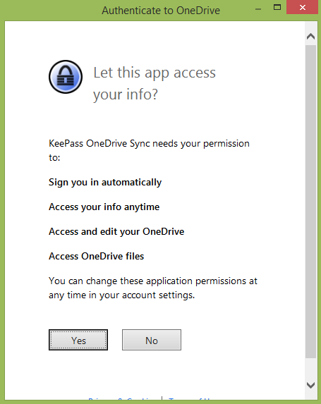
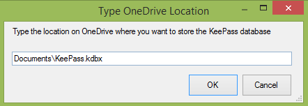

# KeePass OneDrive Sync

## Installation instructions

1. [Download the plugin file from GitHub](https://github.com/KoenZomers/KeePassOneDriveSync/raw/master/KeeOneDriveSync.plgx)
2. Copy the file into the KeePass 2 installation folder. Typically this is C:\Program Files (x86)\KeePass Password Safe 2
3. Start KeePass, it should parse the plugin. You can verify if the plugin was loaded successfully by going to Tools -> Plugins and verifying that an enty named "KoenZomers.KeePass.OneDriveSync" is present 
 
4. Create a new KeePass database or open an already existing locally stored KeePass database. It's currently not yet supported to open a KeePass database directly from OneDrive, so manually download it first as a one time action. Do not store it on your PC where you are also using the native OneDrive sync tool to sync your files as this will mess up things. KeePass OneDriveSync will take care of synchronizing your database instead.
5. When you open an existing KeePass database, it will ask you if you want to connect it to OneDrive. Make sure Yes is selected and click OK. If you choose to create a new KeePass database, as soon as you save it for the first time, it will ask you if you want to connect it to OneDrive. Select Yes and click OK. 
6. Log in to the OneDrive where you want to sync your KeePass database to. . Multi Factor Authentication on OneDrive is also supported.

7. Give consent to the plugin being able to access and update your files on OneDrive. This is required for the plugin to work. Only the local plugin on your PC will then be able to access your OneDrive. It doesn't go through any server from me neither do your credentials or access/refresh tokens get shared with anyone or anything. 
8. Type the path on OneDrive where you want to store the KeePass database. I.e. if you have a folder named KeePass in your OneDrive root and you wish to store the database named as Passwords.kdbx, enter KeePass\Passwords.kdbx. If a KeePass database already exists at the path you specify, it will be synced with the local KeePass database you just opened. If it doesn't exist yet on OneDrive, the local KeePass database will be copied to it and synced from thereon. I hope to replace this screen with an easier to use OneDrive file browser in the future. 
9. You're now ready to use KeePass. If you make changes to your KeePass file and save it, it will automatically sync it with the version on OneDrive. If you open the KeePass database locally, it will automatically check OneDrive if there's an updated version and only if so, it will sync it.
