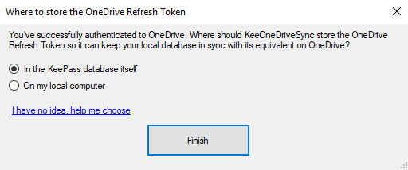

# KeePass OneDrive Sync

## OneDrive Refresh Token

When setting up a new synchronization connection between a local KeePass database and OneDrive, one of the questions you will get is where you want the OneDrive Refresh Token to be stored.

### Why does it matter

The OneDrive Refresh Token, along with the Client ID and Client Secret which can easily be retrieved from the open source code of this plugin, gives full unrestricted access to your OneDrive.

It is built this way because we don't want to prompt you for your credentials each time KeePass needs to sync the database with OneDrive.

This means that the Refresh Token should be kept secure and safe from anyone else to avoid them getting access to your complete OneDrive without you even knowing it and bypassing Multi Factor Authentication, if you have set that up.

### Which options do I have

You can choose from the following two options:

1. Store the Refresh Token in the KeePass database itself
2. Store the Refresh Token int he KeePass configuration file on your PC

I will explain both options below. If you don't really care about the details, just go with the default option 1 which will suit most users in most scenarios.

#### 1. KeePass database

The first option is to store the OneDrive Refresh Token in the encrypted KeePass database itself. Only after unlocking the KeePass database by using whichever means you've set it to (password, certificate, windows credentials), the OneDrive Refresh Token will be accessible by the plugin to be used.

This means that the OneDrive Refresh Token is part of the KDBX file. If you copy the file over to someone else (i.e. a co-worker), you are effectively copying the OneDrive Refresh token to your OneDrive along with it. This might not be what you want to happen. If the other user opens the KeePass database and doesn't have the KeeOneDriveSync plugin installed in KeePass, nothing happens for that user and the database will function as normal. If that user does have the KeeOneDriveSync plugin installed as well, it will prompt again to authenticate to OneDrive. It will NOT reuse the token that it already has stored in the KeePass database for security reasons. Technically however if the other user has access to the KeePass database, the user could write its own code to fetch the OneDrive Refresh Token from the database. Bit of a long shot, but technically possible.

So if you intend to share your KeePass database with others and you don't want them to sync it to the same OneDrive location, do not use this option and choose the second option.

#### 2. KeePass Configuration File

Located under %APPDATA%\KeePass (enter it like this in Windows Explorer) KeePass by default stores a configuration file as KeePass.config.xml.

If you choose this option, the OneDrive Refresh Token will be stored PLAIN TEXT in this configuration file. This means that if anyone can access your computer remotely, i.e. you have a virus or trojan or you're sharing your PC with others and the others have local Administrator rights on the same PC, they can access this file and open it up in any text editor like NotePad and retrieve your OneDrive Refresh Token from it which then gives them full access to your complete OneDrive.

This option can be used if you're the only one using your PC and you feel safe that nobody can access files stored in your user profile on your PC.

Note that the KeePass.config.xml file will always contain the other configuration settings of your KeePass database, even if you choose to store the OneDrive Refresh Token using the first method. In that case the RefreshToken attribute in the config file will show null as it's being fetched from another location. The other information is not sensitive information, thus can perfectly be stored in this file.