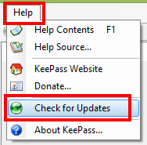
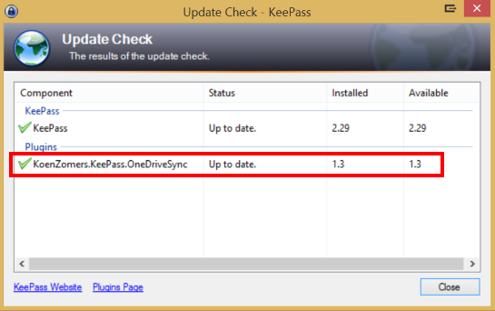

# KeePass OneDrive Sync

I've created a free plugin for KeePass that allows syncing of multiple password databases from multiple OneDrives to a local version. It allows you to synchronize an unlimited amount of KeePass datbases with an unlimited amount of OneDrives. So i.e. you can synchronize your personal KeePass database with your personal OneDrive and your work related KeePass with a OneDrive that is shared among your colleagues, if you wish.

## Installation instructions

[Click here to view the installation instructions](Installation Instructions.md)

## Configuration Options

Under Tools -> OneDrive Sync Options you will find all the KeePass databases that are set up for synchronization through the plugin. Note that the local file path is the key of the configuration for the synchronization. This means that if you would move the locally stored KeePass database, you will have to set up the synchronization with OneDrive again.

In this configuration window you can right click on an entry to get a context menu with options for that specific KeePass database.

I.e. you can choose to delete configuration of KeePass databases you no longer want to synchronize (keyboard shortcut DEL). You can also force a synchronization to happen or view the underlying details of a synchronization as to which OneDrive it is being synced to and to which folder.

You can also choose to view more details on the configuration kept for a KeePass database synchronization (keyboard shortcut ENTER).

## Checking for updates

You can easily check from within KeePass if there are updates for this plugin available. Just open KeePass, go to Help on the top menu and click on Check for Updates.

Here it will perform a check for KeePass itself and all installed plugins if they're up to date.

If a new version is available, just come to this page again, download the latest plugin and overwrite the PLGX file in your KeePass installation folder.

## Todo

On my todo list are still:

1. Add a OneDrive File browser for easier selection of a location on OneDrive 
2. Allow a KeePass database to be opened directly from OneDrive without the need to download it yourself first

## Special Thanks

Special thanks to Oleksandr Senyuk for making [KeeSkyDrive](http://sourceforge.net/projects/keeskydrive/) as it has inspired me to create this plugin.

## Feedback

Comments\suggestions\bug reports are welcome!

Koen Zomers
mail@koenzomers.nl
