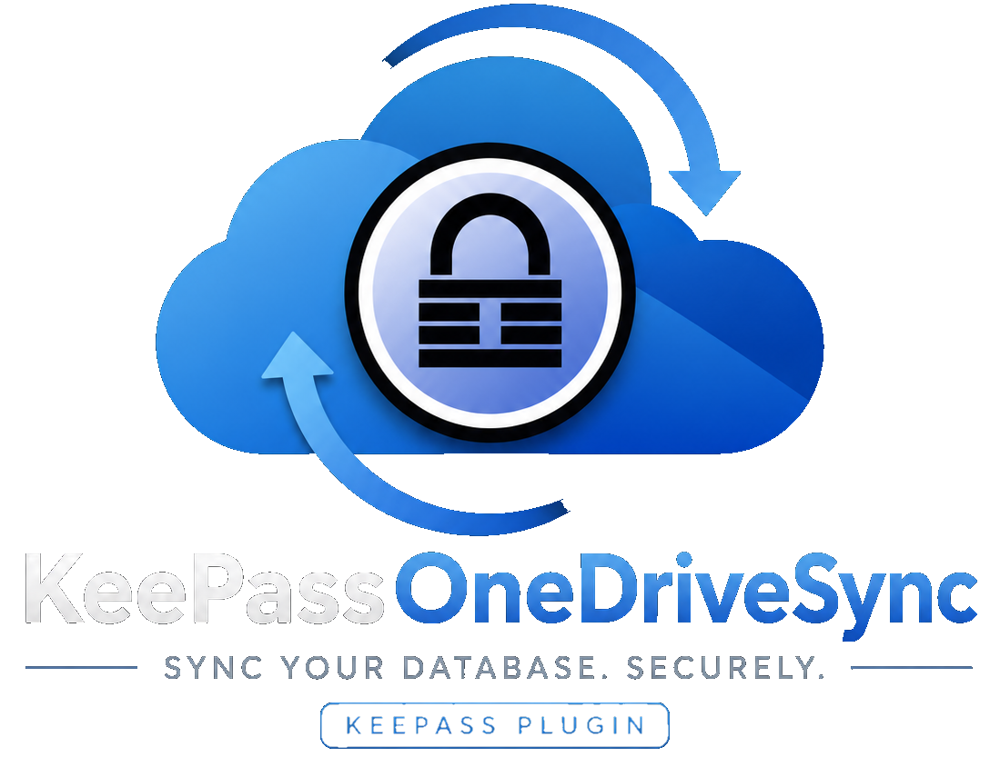

   

A free plugin for KeePass (installable and portable) that allows syncing of multiple password databases from multiple OneDrives to a local version. It allows you to synchronize an unlimited amount of KeePass databases with an unlimited amount of OneDrives. So i.e. you can synchronize your personal KeePass database with your personal OneDrive and your work related KeePass with a OneDrive for Business on Microsoft 365 that is shared among your colleagues, if you wish. This way it's also easy to be able to access your same KeePass database from all of your devices. Note that this plugin is only supported on Windows based platforms, but [has been reported to work on \*nix as well using Mono](https://github.com/KoenZomers/KeePassOneDriveSync/wiki/System-Requirements#nix-through-mono). It can also operate in conjunction with other KeePass plugins serving other operating systems such as KeePass2Android on Android devices.

## How to use
Download the **KeePassOneDriveSync-\<version\>.plgx** from [here](../../releases/latest) and place it into your KeePass\Plugins folder. Typically this will be `C:\Program Files\KeePass Password Safe 2\Plugins` or if you're using KeePass Portable, put it in a subfolder called Plugins from where your keepass.exe is located.

When upgrading from a previous version of this plugin, simply ensure KeePass is closed, delete the existing KeePassOneDriveSync folder inside the KeePass plugins folder, if it exists, delete any existing KeePassOneDriveSync.plgx or KeePassOneDriveSync-\<version\>.plgx files and copy the new KeePassOneDriveSync-\<version\>.plgx file into the KeePass plugins folder and launch KeePass again.

[You can find the latest version here](../../releases/latest)

## Documentation
- [System requirements](https://github.com/KoenZomers/KeePassOneDriveSync/wiki/System-Requirements)
- [Installation instructions](https://github.com/KoenZomers/KeePassOneDriveSync/wiki/Installation-instructions)
- [Configuration options](https://github.com/KoenZomers/KeePassOneDriveSync/wiki/Configuration-options)
- [Checking for updates](https://github.com/KoenZomers/KeePassOneDriveSync/wiki/Update-check)
- [Troubleshooting](https://github.com/KoenZomers/KeePassOneDriveSync/wiki/Troubleshooting)
- [Frequently Asked Questions](https://github.com/KoenZomers/KeePassOneDriveSync/wiki/FAQ)

## Changelog

[Full version history](Changelog.md)

## Special Thanks

Special thanks to Oleksandr Senyuk for making [KeeSkyDrive](http://sourceforge.net/projects/keeskydrive/) as it has inspired me to create this plugin.
